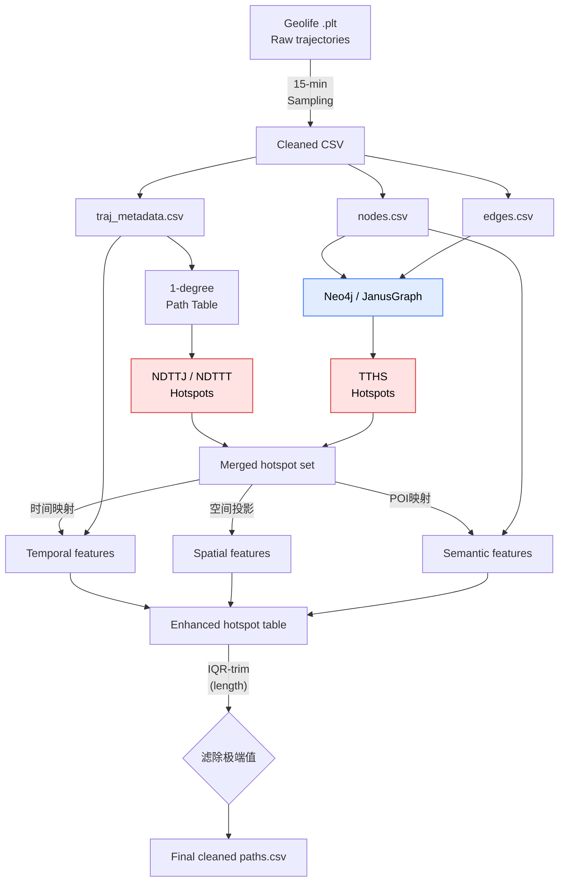

# Draft Research Proposal

## 轨迹热点挖掘的基础概念与公式

### 1. 关系（Relation）

给定集合  
\(A=\{a_1,a_2,\dots,a_n\}\) 和 \(B=\{b_1,b_2,\dots,b_m\}\)，如果元素 \(a_i\) 和 \(b_j\) 之间存在关系，则定义如下：

- **单向关系**：\(a_i \to b_j\) 或 \(a_i \leftarrow b_j\)  
- **双向关系**：\(a_i \leftrightarrow b_j\)

### 2. 并置模式（Co-location）

定义集合 \(A,B\) 之间的关系集合 \(R_{AB}\) 为并置模式：

\[
R_{AB}=\{a \to b \lor b \to a \lor a \leftrightarrow b \mid a\in A,\;b\in B\}
\]

### 3. 参与集（Participation Set）

集合 \(A,B\) 之间的所有关系所含元素的集合：

\[
C=\{\forall a,\forall b \mid a\in A,\;b\in B,\;\exists a\to b \lor \exists b\to a\}
\]

### 4. 参与度（Participation Rate）

衡量集合 \(A,B\) 之间关系的强度：

\[
\gamma_{AB}=\frac{|C|}{|A|+|B|}
\]

### 5. 频繁并置（Prevalent Co-location）

若参与度满足阈值 \(\gamma_{min}\)，则称为频繁并置模式集合：

\[
PR_{AB}=\{R_{AB}\mid\gamma_{AB}\geq\gamma_{min}\}
\]

### 6. 轨迹序列（Trajectory Sequence）

由物理空间中 \(k\) 个坐标点按照时间顺序线性连接构成：

\[
R=\{N,E\}
\]

其中：

- \(N=\{n_1,n_2,\dots,n_k\}\) （轨迹点集合）  
- \(E=\{e_1,e_2,\dots,e_{k-1}\}\) （轨迹边集合）

### 7. 轨迹序列集合（Trajectory Sequence Set）

如果集合 \(G_a\) 由 \(m\) 条轨迹序列构成，则定义为：

\[
G_a=\{R_1,R_2,\dots,R_m\}
\]

### 8. 轨迹序列并置（Trajectory Sequence Co-location）

如果 \(G_b\subseteq G_a\)，且 \(G_b\) 中所有轨迹都经过节点 \(n_i\)，则称 \(G_b\) 为轨迹序列并置集合，\(n_i\) 为并置节点。

### 9. 轨迹序列频繁并置（Trajectory Sequence Prevalent Co-location）

假设轨迹序列并置集合 \(G_c\) 中的轨迹数量为 \(m\)，且满足频繁度阈值：

\[
m \geq m_{min},\quad m_{min} \ge 2
\]

则称 \(G_c\) 为轨迹序列频繁并置集合。

### 10. 轨迹热点（Trajectory Hotspots）

在轨迹序列频繁并置集合中，如果存在 \(k \ge 2\) 个连续的并置节点，且满足路径长度阈值：

\[
k \ge k_{min},\quad k_{min} \ge 2
\]

则称 \(G_d\) 上存在轨迹热点 \(H\)：

\[
H=\{n_1\to n_2\to \dots \to n_k\}
\]

---

# 实验原理

> **课题**：基于热点轨迹的频繁模式挖掘研究  
> **目标**：在保证时空效率的前提下，体系化挖掘 Geo-Trajectories 数据中的热点路径（Hotspot Trails），并为后续的行为预测与智能推荐奠定理论基础。

---

## 1. 轨迹数据建模

设移动对象的原始轨迹为离散点序列  
\(R=\{p_1,p_2,\dots,p_m\}\)，其中

\[
p_i=(x_i,y_i,t_i,\text{meta}_i),\qquad i=1,\dots,m.
\]

为了降低计算复杂度与噪声，采用 **时间采样** \(\Delta t=15\text{ min}\) 与 **空间网格化**（R&D 网格）将原始轨迹映射到 **节点集合** \(V\) 与 **有向边集合** \(E\)：

* **节点**：\(v\in V \iff \exists p_i\text{ 落入网格 }g_v\)  
* **边**：\(e=(v_i\rightarrow v_j)\in E \iff p_{k}\in g_{v_i},\;p_{k+1}\in g_{v_j}\)

得到 **一阶路径表**（1-degree path table）：

\[
T_1=\{\bigl(v_i, v_j, \text{traj\_set}_{ij}\bigr) \mid (v_i\to v_j)\in E\}.
\]

其中 \(\text{traj\_set}_{ij}\) 为经过该边的轨迹 ID 集合。

---

## 2. 并置模式与热点路径定义

### 2.1 并置模式（Co-location Pattern）

给定两个对象集 \(A,B\) 与空间关系谓词 \(\mathcal{R}(\cdot)\)，其并置模式定义为

\[
\mathcal{C}_{A,B}=\bigl\{(a,b)\mid a\in A,\;b\in B,\;\mathcal{R}(a,b)=\text{true}\bigr\}.
\]

### 2.2 频繁并置

参与度  

\[
\gamma_{A,B}=\dfrac{|\mathcal{C}_{A,B}|}{|A|+|B|}.
\]

若 \(\gamma_{A,B}\ge \gamma_{\min}\)，称 \(A,B\) 存在 **频繁并置**。

### 2.3 热点路径（Hotspot Trail）

- **长度阈值** \(k_{\min}\)  
- **支持阈值** \(m_{\min}\)

若存在有向节点序列 \(H=(v_1\to\dots\to v_k)\) 满足：

1. \(k\ge k_{\min}\)  
2. 经过该序列的轨迹集合 \(\mathrm{SG}_H\) 满足 \(|\mathrm{SG}_H|\ge m_{\min}\)

则称 \(H\) 为 **热点路径**。

---

## 3. 三类热点挖掘算法

| 类别 | 代表 | 适用场景 | 核心复杂度 |
|------|------|-----------|------------|
| Apriori-Join | **NDTTJ** | 轨迹稀疏 | \(\mathcal{O}(n^2)\) 时间 / \(\mathcal{O}(n^2)\) 空间 |
| Pattern-Growth | **NDTTT** | 轨迹密集 | \(\mathcal{O}(n\log n)\) 时间 / \(\mathcal{O}(n)\) 空间 |
| Graph-Traversal | **TTHS** | 大规模图结构明显 | \(\mathcal{O}(n)\) 时间 / \(\mathcal{O}(n)\) 空间 |

### 3.1 NDTTJ — N-Degree Trajectory Table *Join*

1. **初始队列**：筛出满足 \(m_{\min}\) 的一阶边。  
2. **连接规则**：若  
   \(p_1=(v_1\dots v_r),\;p_2=(v_r\dots v_{r+1})\)，则  

   \[
   \text{new\_path}=p_1\cup p_2,\qquad
   \text{new\_sg}=\text{sg}_{p_1}\cap \text{sg}_{p_2}.
   \]

3. **剪枝**：若 \(|\text{new\_sg}|<m_{\min}\) 则丢弃。  
4. 迭代至无新路径或达到 \(\text{max\_depth}\)。

### 3.2 NDTTT — N-Degree Trajectory Table *Traversal*

深度优先，以尾节点为锚增长，不产生候选集，适合稠密路径。

### 3.3 TTHS — Trajectory-Traversal Hotspot Search

利用 Neo4j / JanusGraph **免索引邻接**优势，按边权“度”剪枝。

---

## 4. 多维特征工程

### 4.1 时间特征

- **平均起始时刻**  

  \[
  \bar{h}=\frac{1}{|\mathrm{SG}|}\sum_i h_i
  \]

- **时间熵**  

  \[
  H_t=-\sum_{b} p_b\log_2 p_b
  \]

### 4.2 空间特征

- **欧氏路径长**  

  \[
  L=\sum_{i=1}^{k-1}\|\mathbf{v}_{i+1}-\mathbf{v}_i\|_2
  \]

- **空间熵**：对经纬度各做 1D 熵并求和

### 4.3 语义特征

- **主导 POI**：\(\arg\max_{c} \text{freq}(c)\)  
- **POI 熵** \(H_{poi}\)，衡量类型多样性

---

## 5. 数据流程汇总

---